#  ErgoLens — AI Book Insight Platform

> A sophisticated Full-Stack RAG ecosystem designed to transform literary catalogs into interactive, semantic knowledge systems.

ErgoLens is a high-performance document intelligence platform that bridges the gap between static book data and dynamic AI exploration. By integrating automated web scraping, high-dimensional vector search, and Large Language Model orchestration, ErgoLens delivers deep-dive semantic analysis, interactive Q&A, and personalized literary discovery — all from a single, unified interface.

---

## 📑 Table of Contents

- [Overview](#-overview)
- [Architecture](#-architecture)
- [RAG Pipeline Workflow](#-rag-pipeline-workflow)
- [Data Ingestion Workflow](#-data-ingestion-workflow)
- [Authentication Flow](#-authentication-flow)
- [Key Features](#-key-features)
- [Technology Stack](#-technology-stack)
- [Project Structure](#-project-structure)
- [Backend Deep Dive](#-backend-deep-dive)
- [Frontend Deep Dive](#-frontend-deep-dive)
- [Platform Screenshots](#-platform-screenshots)
- [Setup & Installation](#-setup--installation)
- [Notes & Troubleshooting](#-notes--troubleshooting)

---

## 🔭 Overview

ErgoLens is built around three core pillars:

1. **Intelligence** — A Retrieval-Augmented Generation (RAG) pipeline that grounds LLM responses in actual book data, eliminating hallucinations and providing verifiable, cited answers.
2. **Automation** — A headless web scraping engine that autonomously populates the database with rich literary metadata from external catalogs.
3. **Experience** — A reactive glassmorphic UI with full dark/light mode support, JWT-protected routes, and real-time AI insight generation.

---

## 🏛️ Architecture

ErgoLens follows a fully decoupled full-stack architecture. The Django REST Framework backend and React 18 frontend are independent services that communicate exclusively through a secured REST API.

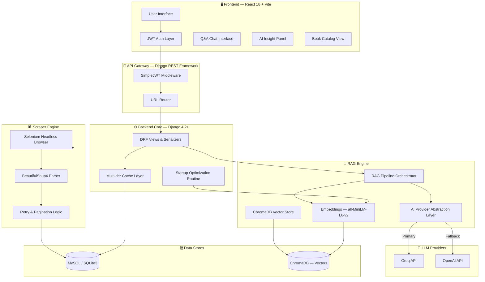

---

## 🧠 RAG Pipeline Workflow

The Retrieval-Augmented Generation pipeline is the intelligence backbone of ErgoLens. It ensures that every AI response is grounded in actual ingested book data rather than pure model hallucination.

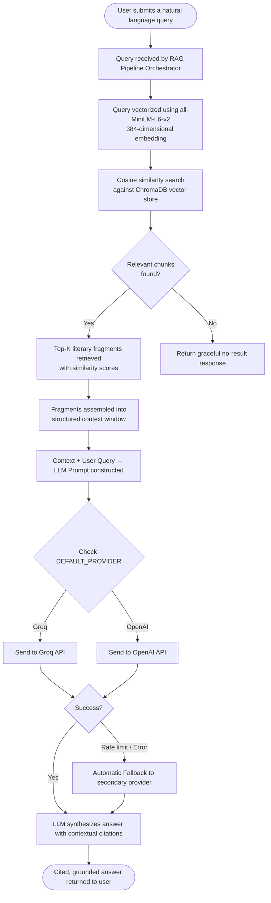

### RAG Processing Stages

**Stage 1 — Semantic Chunking**

Raw book text is broken down using a recursive algorithm with semantic overlap. Overlap ensures that no contextual meaning is lost at chunk boundaries — important for books where a concept spans multiple paragraphs.

**Stage 2 — Vector Indexing**

Each chunk is passed through the `all-MiniLM-L6-v2` SentenceTransformer model (pre-loaded at startup) and converted into a 384-dimensional floating-point vector. These vectors are persisted into ChromaDB, keyed against their source book metadata.

**Stage 3 — Contextual Retrieval**

A user query is embedded into the same 384-dimensional space. ChromaDB performs a cosine similarity search, returning the most semantically related literary passages regardless of exact keyword match.

**Stage 4 — LLM Synthesis**

The retrieved passages are bundled into a structured prompt alongside the original user query. The AI Provider Abstraction Layer dispatches this to the configured LLM, handling rate limiting, timeouts, and automatic provider failover transparently.

---

## 🕷️ Data Ingestion Workflow

ErgoLens automates the process of populating its database with book data from external literary catalogs. The scraper is production-hardened with retry logic, dynamic wait states, and pagination traversal.

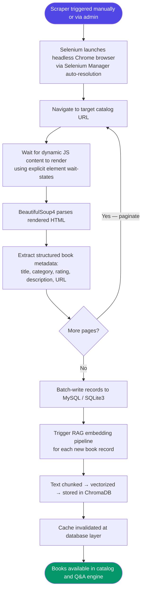

---

## 🔐 Authentication Flow

All advanced features — AI insights, chat history, sentiment analysis — are protected behind JWT-authenticated routes.

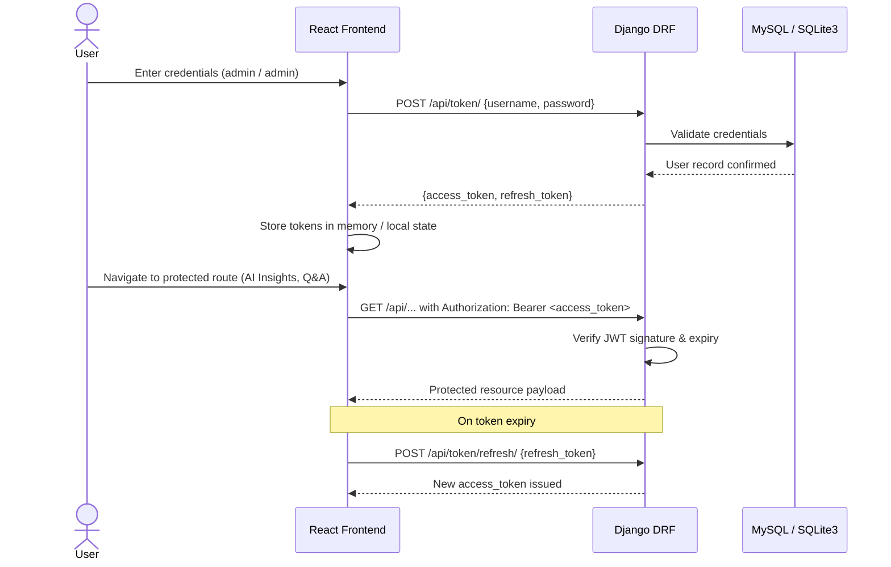

---

## 🚀 Key Features

### 🧠 RAG-Powered Q&A
Ask the library anything in plain English. The engine retrieves semantically relevant passages from ChromaDB and synthesizes a grounded, cited answer — not a generic LLM response.

### 🤖 AI Insight Suite

| Insight Type | Description |
|---|---|
| Sentiment Analysis | Classifies the emotional tone of a book — positive, negative, mixed — with supporting justification |
| Automated Summarization | Generates concise overviews and key plot deductions from ingested book data |
| Smart Recommendations | Produces personalized reading list suggestions based on conceptual similarity |

### 🔍 Semantic Vector Search
Discover books based on conceptual meaning rather than exact title or keyword match. A query like "stories about grief and memory" surfaces thematically relevant titles even without those exact words.

### 🕸️ Headless Web Scraping
Trigger background scraping jobs from the admin panel to autonomously extract and ingest rich book metadata from live external catalogs — complete with pagination handling and retry logic.

### 🌗 Responsive Glassmorphic UI
System-native dark and light mode with a premium frosted glass design language. Fully responsive across desktop and mobile viewports.

### ⚡ Warm Start Optimization
The `all-MiniLM-L6-v2` model is pre-loaded at application boot via a centralized Startup Optimization Routine. This eliminates cold-start latency on the first request and auto-detects CUDA-enabled GPUs for hardware-accelerated vectorization.

---

## 🛠️ Technology Stack

| Domain | Technology |
|---|---|
| Frontend Framework | React 18, Vite |
| UI Styling | Tailwind CSS v4, Glassmorphism Design System |
| Icons | Lucide Icons |
| Backend API | Django 4.2+, Django REST Framework (DRF) |
| Authentication | SimpleJWT |
| Relational Database | MySQL (production), SQLite3 (sandbox) |
| Vector Database | ChromaDB (persistent local store) |
| Embedding Model | `all-MiniLM-L6-v2` via Sentence-Transformers |
| LLM Providers | Groq API, OpenAI API |
| Web Scraping | Selenium, BeautifulSoup4 |

---

## 📁 Project Structure

```
ErgoLens/
│
├── backend/
│   ├── .env                        # Environment variables (created from .env.example)
│   ├── .env.example                # Template for environment configuration
│   ├── requirements.txt            # Python dependencies
│   ├── manage.py                   # Django management entry point
│   ├── startup.py                  # Warm start model pre-loader
│   ├── chroma_db/                  # Persistent ChromaDB vector store
│   │
│   ├── rag/
│   │   ├── embeddings.py           # SentenceTransformer vectorization logic
│   │   ├── vector_store.py         # ChromaDB interface layer
│   │   └── pipeline.py             # High-level RAG orchestrator
│   │
│   ├── scraper/
│   │   ├── selenium_scraper.py     # Headless browser automation
│   │   └── parser.py               # BeautifulSoup4 structural parser
│   │
│   └── api/
│       ├── models.py               # Django ORM models (Book, Insight, etc.)
│       ├── serializers.py          # DRF serializers
│       ├── views.py                # API endpoint handlers
│       ├── urls.py                 # URL routing
│       └── management/
│           └── commands/
│               └── seed.py         # Database seeding command
│
├── frontend/
│   ├── package.json
│   ├── vite.config.js
│   └── src/
│       ├── components/             # Reusable UI components
│       ├── pages/                  # Route-level page components
│       ├── hooks/                  # Custom React hooks
│       ├── api/                    # Axios API client wrappers
│       └── context/                # JWT auth context & state
│
└── screenshots/                    # Platform visual gallery
```

---

## 🔌 Backend Deep Dive

### `startup.py` — Warm Start Optimization

The Startup Optimization Routine fires once when Django boots. It pre-loads the `all-MiniLM-L6-v2` SentenceTransformer model into memory before any request arrives. This routine also interrogates available hardware — if a CUDA-enabled GPU is detected, it routes model operations to the GPU for significantly accelerated throughput. CPU fallback is automatic and graceful.

Without this routine, the first embedding request would incur a multi-second model load delay. With it, the first query is as fast as every subsequent one.

### `rag/` Module — Vector Lifecycle

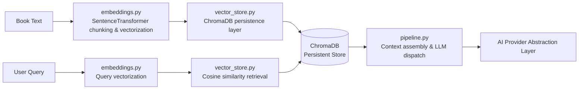

- `embeddings.py` — Wraps the SentenceTransformer model. Handles both document chunking (with semantic overlap) and query embedding. Keeps all vectorization logic centralized and model-agnostic.
- `vector_store.py` — Provides a clean interface to ChromaDB. Handles collection creation, upsert operations, and similarity search. Abstracts all ChromaDB API details from the rest of the application.
- `pipeline.py` — The top-level RAG orchestrator. Accepts a raw user query, coordinates retrieval through `vector_store.py`, assembles the context window, constructs the LLM prompt, and dispatches to the AI Provider Abstraction Layer. Returns a fully cited response object.

### `scraper/` Module — Data Ingestion Engine

The scraper uses **Selenium Manager** to automatically resolve and download the correct ChromeDriver version — no manual driver management required. The flow:

1. A headless Chrome instance is launched and navigates to the target catalog.
2. Explicit wait conditions (not brittle `time.sleep` calls) ensure dynamic JavaScript content is fully rendered before parsing begins.
3. BeautifulSoup4 parses the rendered HTML and extracts structured book fields: title, category, rating, price, description, and detail URL.
4. Pagination is handled automatically — the scraper advances through catalog pages until no further pages are detected.
5. On network errors or element-not-found exceptions, exponential retry logic re-attempts the operation before failing gracefully.

### AI Provider Abstraction Layer

The abstraction layer decouples the RAG pipeline from any specific LLM vendor. It reads `DEFAULT_PROVIDER` from the environment and routes the assembled prompt accordingly. If the primary provider returns a rate-limit error, an authentication failure, or a timeout, the layer automatically retries the identical prompt against the secondary provider — with no intervention required and no error surfaced to the user.

---

## 🎨 Frontend Deep Dive

The React 18 frontend is built with Vite for near-instant hot module replacement during development. All routing is client-side via React Router, with route guards that check JWT validity before rendering any protected component.

**Design System**

Tailwind CSS v4 is used exclusively for styling. The glassmorphism aesthetic is implemented through layered `backdrop-blur`, `bg-opacity`, and `border` utilities. System dark/light mode is detected via the `prefers-color-scheme` media query and toggled from the navbar — the preference is persisted across sessions.

**State Management**

JWT access and refresh tokens are managed through a global React Context. The Axios client is configured with request interceptors that automatically attach the `Authorization: Bearer` header to every outbound API call, and response interceptors that transparently refresh expired tokens before retrying the original request.

**AI Insight Panel**

Each book's detail page includes a dedicated AI Insight Panel with three independently triggerable actions: Sentiment Analysis, Summarization, and Recommendations. Each action dispatches to a separate backend endpoint, streams the loading state through a spinner, and renders the result in a styled card — all without page navigation.

---

## 📸 Platform Screenshots

### 🌐 Landing & Discovery

The entry point of ErgoLens — a clean, system-responsive dashboard presenting the full literary collection. The glassmorphic navbar provides access to the catalog, Q&A engine, and theme toggle.

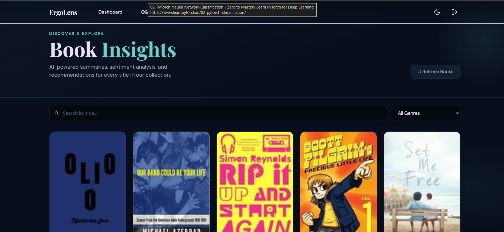

---

### 📚 Book Catalog

The catalog view displays all ingested books with real-time search and category filtering. Each card shows the book's title, rating, category, and a quick-action button to open its detail page or trigger AI insights directly.

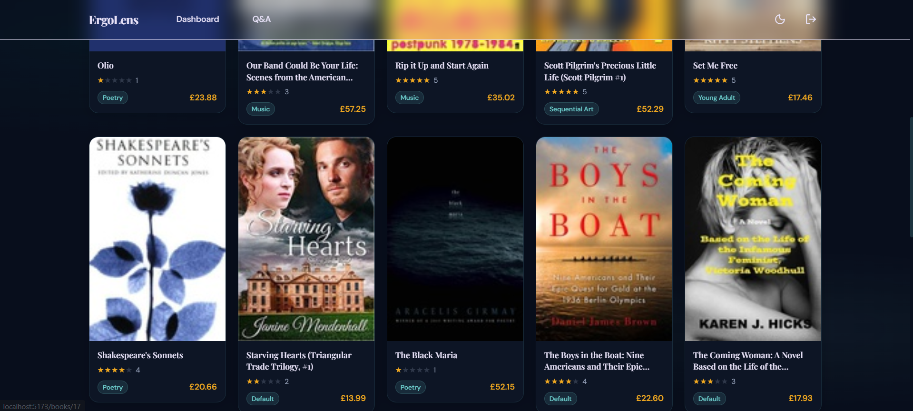

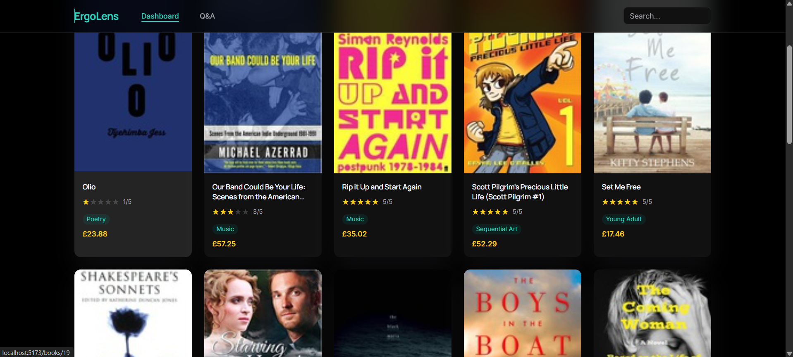

---

### 📄 Book Detail & Metadata

The detail view surfaces comprehensive book metadata: cover, title, category, rating, price, and description. From here, users can directly trigger sentiment analysis, summarization, recommendations, and semantic similarity search — all without leaving the page.

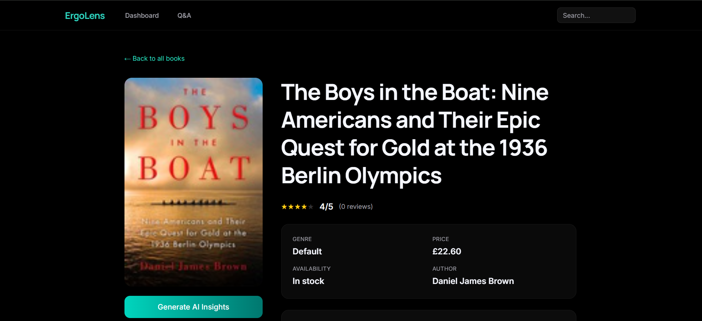

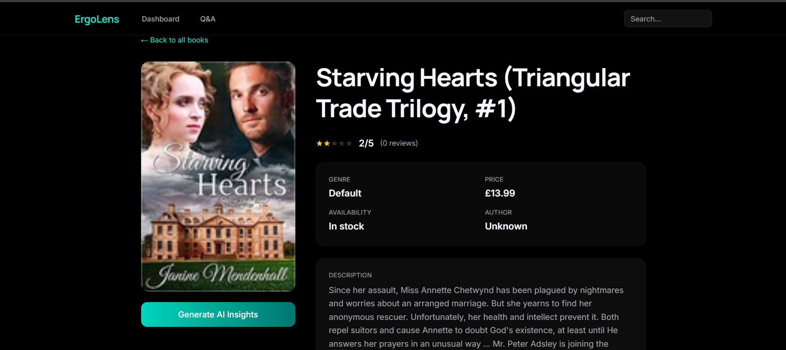

---

### 💬 Intelligent Q&A — RAG Interface

The Q&A interface connects directly to the RAG pipeline. Users type natural language queries and receive answers grounded in the ingested literary corpus — complete with contextual citations pointing back to the source book passages. No fabricated responses; every answer is traceable.

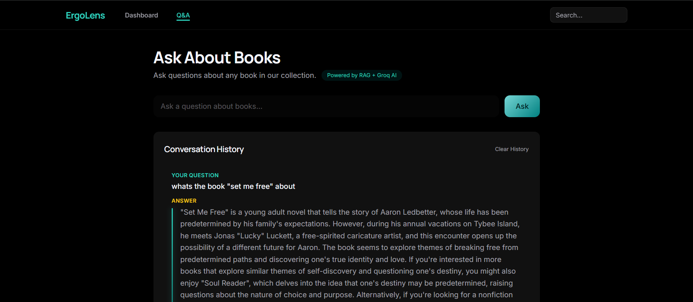

---

### 🔮 AI Insight Suite

Three dedicated AI analysis modes, each independently triggerable from any book's detail page.

**Sentiment Analysis**

Classifies the emotional profile of a book — positive, negative, or mixed — with a detailed justification drawn from the book's content. Useful for readers who want to gauge tone before committing to a title.

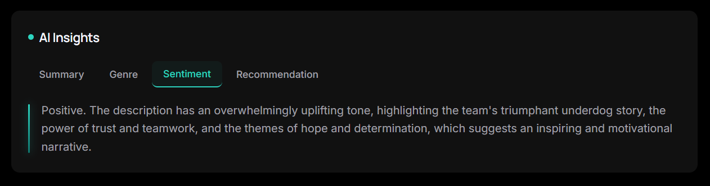

**Automated Summary**

Generates a concise, structured overview of the book's themes, narrative arc, and key takeaways. The summary is synthesized from the ingested text via the RAG pipeline — not from a generic pre-trained knowledge base.

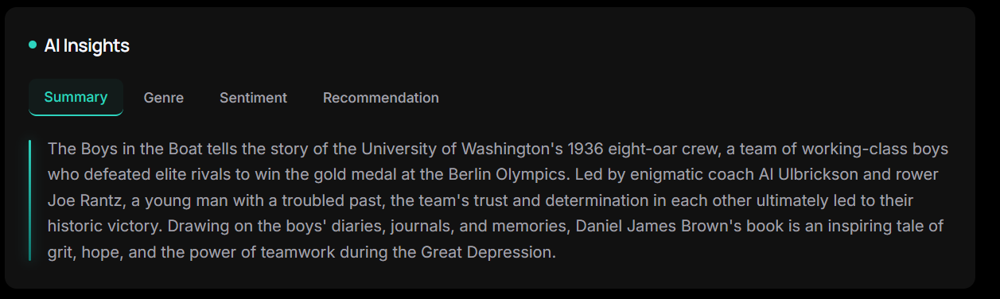

**Smart Recommendations**

Produces a curated list of reading recommendations personalized to the selected book's genre, themes, and tone. Discovery logic draws from both the vector store and LLM reasoning to surface titles the user is likely to enjoy.

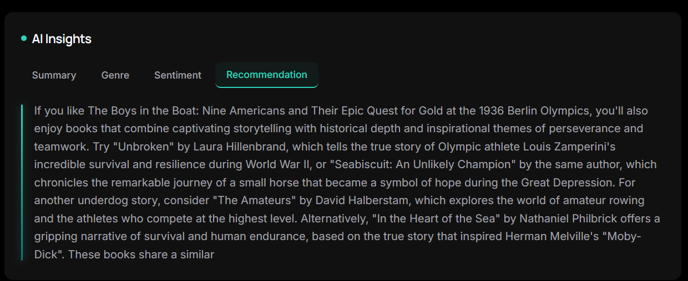

---

### 🔗 Semantic Similarity

Books conceptually similar to the currently viewed title are retrieved directly from the ChromaDB vector store via cosine similarity. Results are ranked by semantic closeness — not keyword overlap — surfacing books that share thematic DNA even when they share no common words in their titles or descriptions.

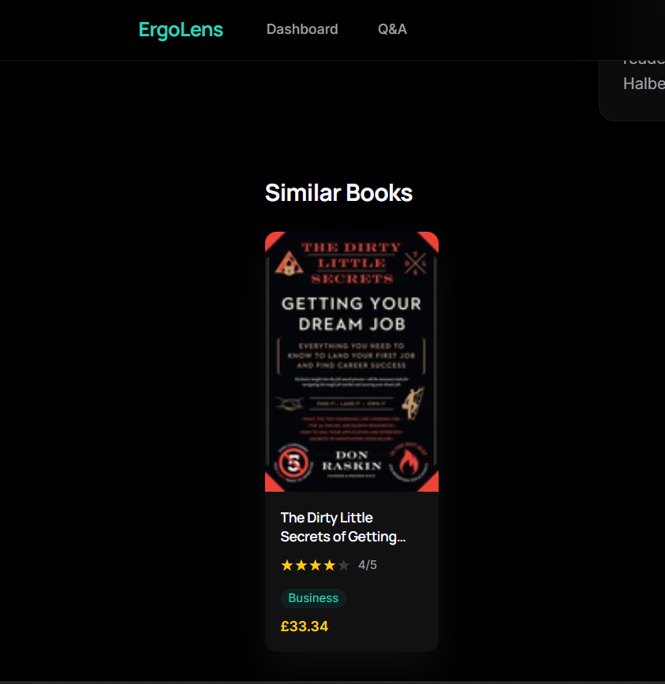

---

## ⚙️ Setup & Installation

For a complete, step-by-step guide covering environment variables, database configuration (MySQL and SQLite3), migrations, data seeding, scraper execution, and frontend bootstrapping, refer to the dedicated setup documentation:

👉 **[View the Complete Setup Guide — SETUP.md](SETUP.md)**

**Quick summary of steps:**

1. Create and activate a Python virtual environment inside `backend/`
2. Install dependencies via `pip install -r requirements.txt`
3. Copy `.env.example` to `.env` and configure your API keys and DB engine
4. Run `python manage.py makemigrations && python manage.py migrate`
5. Seed the database with `python manage.py seed` (creates `admin` / `admin` account + mock books)
6. Start the backend with `python manage.py runserver`
7. In a second terminal, navigate to `frontend/`, run `npm install` then `npm run dev`
8. Open `http://localhost:5173/` and log in with `admin` / `admin`

---

## 📋 Notes & Troubleshooting

**Author Data**
All scraped books default their author field to "Unknown" — this is a constraint of the source catalog structure, which does not expose author metadata in a reliably parseable format.

**LLM Provider Fallback**
If the `DEFAULT_PROVIDER` (e.g., Groq) is unavailable due to rate limits or a service outage, the AI Provider Abstraction Layer automatically re-routes the request to the secondary provider (OpenAI) without any user-facing error. Both API keys should ideally be configured in `.env` even if only one is set as the default.

**ChromaDB Persistence**
All vector embeddings are stored persistently in `backend/chroma_db/`. This directory is created automatically on first run. Do not delete it between restarts — rebuilding the vector index from scratch requires re-triggering the scraper or re-running the seed command.

**GPU Acceleration**
If your machine has a CUDA-compatible GPU, the Startup Optimization Routine will automatically use it for embedding operations. No additional configuration is required. To verify which device is being used, check the Django console output at startup — it will log `CUDA` or `CPU` accordingly.

**Database Engine Choice**
MySQL is the production-recommended engine. For quick local development or sandboxing without a MySQL installation, set `DB_ENGINE=django.db.backends.sqlite3` in your `.env` file. SQLite3 requires no additional setup.

---

### Developed by Bhavy Manchanda